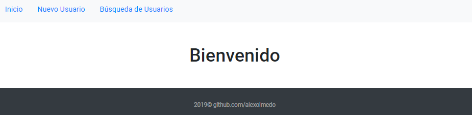
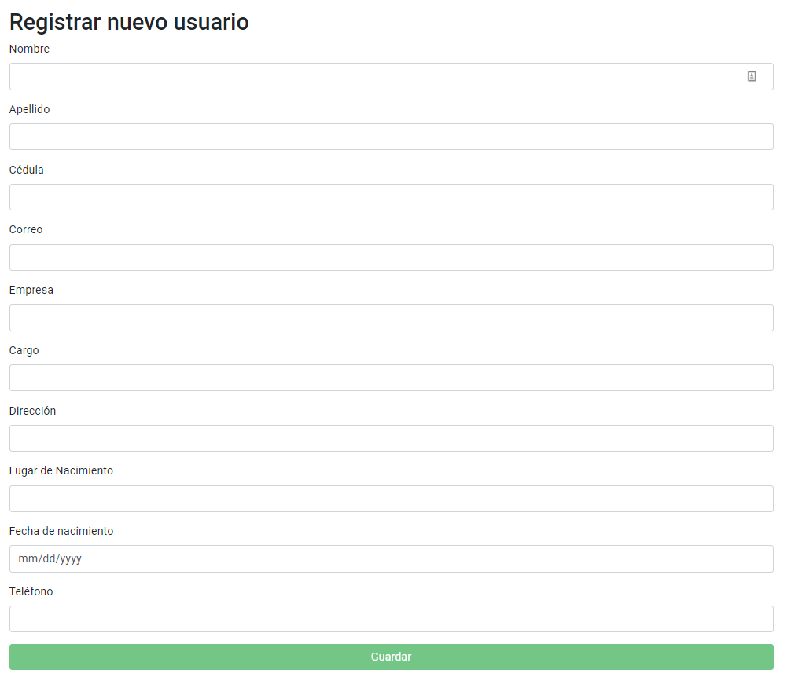
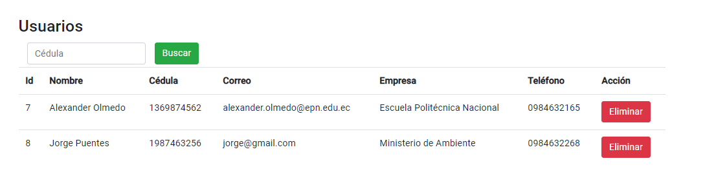

# Demo Project
Este proyecto es una demostración, comprende un frontend diseñado en Angular 8 y un backend basado en Spring Framework 5

## Instalación
### Paso 1: 

Descargar el archivo [prueba-0.0.1-SNAPSHOT.jar](https://github.com/alexolmedo/TasOn_ejercicio/releases/tag/0.0.1)

### Paso 2: 

Ejecutar el archivo descargado con java, el puerto 8080 debe estar libre.
```
java -jar prueba-0.0.1-SNAPSHOT.jar
```
### Paso 3: 

El front end se encuentra subido a la página del repositorio: [https://alexolmedo.github.io/TasOn_ejercicio/](https://alexolmedo.github.io/TasOn_ejercicio/)

## Uso


* Para registrar usuarios ir a la sección Nuevo Usuario



* Para administrar usuarios ir a la sección Búsqueda de Usuarios, aquí se podrán buscar usuarios por su número de cédula, también se pueden eliminar usuarios.


